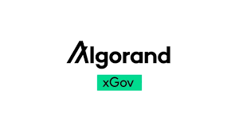

# Algorand xGov
>Decentralized governance running on Algorand.

  

 

    Get Started:
    <a href="https://xgov.algorand.foundation">xGov</a> |
    <a href="./packages/xgov-goal/README.md">Goal</a> |
    <a href="">Kit</a> |
    <a>SDK</a>
  

## Overview 

Prior to a voting round starting, an administrator will collect questions from the community. Once the questions are 
finalized, a snapshot of elegable governors is taken. During the creation of the voting round application, the 
governors snapshot and finalized questions are uploaded to IPFS. 

Every Voting Round Application has a `metadata_ipfs_cid` Global State key, it's value is the unique id of the finalized
questions in IPFS. The questions metadata includes the `voteGatingSnapshotCid` key, which is the unique id of the finalized
snapshot in IPFS.

There are several ways to interact with the contract, the following guides are available:

